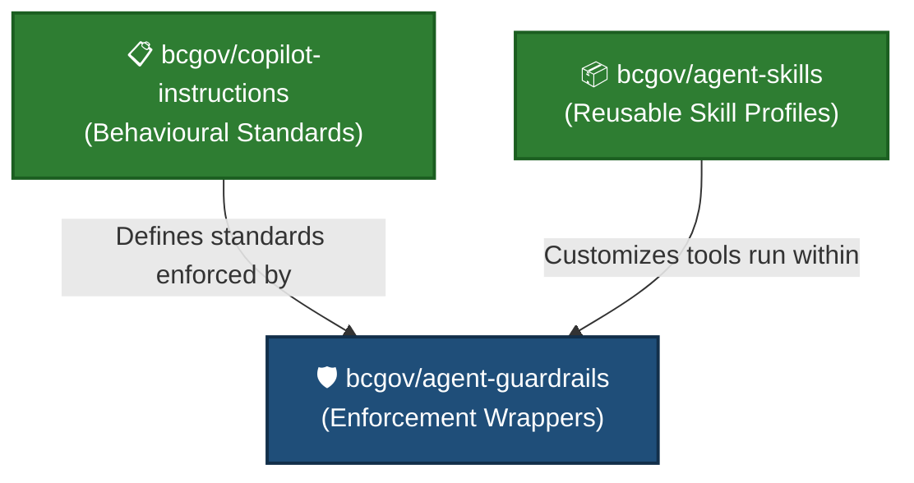

# 🛡️ Agent Guardrails

> **The safety and enforcement layer for AI-assisted development at the BC Government.**

`agent-guardrails` provides local enforcement to prevent common AI accidents, ensure repository compliance, and maintain coding standards. It acts as the execution-time guardrail, intercepting critical commands to keep the development loop secure.

---

## 🚀 Key Features

*   🔒 **Automated Secrets Scanning** — Integrates `gitleaks` locally to block secrets from being committed.
*   🚫 **AI Accident Prevention** — Wraps git commands to prevent agents from bypassing hooks (e.g. `--no-verify`), modifying global configs, or merging PRs directly.
*   📌 **Branch Protection** — Restricts direct commits and pushes to protected branches (`main`/`master`).
*   ⚙️ **Interactive Git Setup** — Optional configuration script to set up robust, human-friendly Git defaults.

---

## 📦 Quick Install

### Core Installation
Run the one-liner setup script (requires `bash` and `curl`):

```bash
curl -fsSL https://raw.githubusercontent.com/bcgov/agent-guardrails/main/setup.sh | bash
```

Alternatively, clone and install locally:

```bash
git clone https://github.com/bcgov/agent-guardrails.git
cd agent-guardrails && ./setup.sh
```

> [!NOTE]
> Restart your terminal or run `source ~/.bashrc` after installation completes.

### Optional: Git Configurations
Set up interactive Git configuration defaults (intended for humans, not AI agents):

```bash
curl -fsSL https://raw.githubusercontent.com/bcgov/agent-guardrails/main/scripts/git-setup.sh | bash
```

---

## 🛠️ Installed Components

| Component | Target Location | Purpose |
| :--- | :--- | :--- |
| **Gitleaks** | `~/.local/bin/gitleaks` | Local scanning for API keys and secrets on commit. |
| **Global Hooks** | `~/.githooks/` | Pre-commit (Gitleaks, version control check) and pre-push hooks. |
| **Shell Safety Wrappers** | `~/.githooks/git-safety.sh` | Shell wrappers loaded in `~/.bashrc` to block unsafe commands. |

---

## 🗺️ Relationship to the AI Stack

`agent-guardrails` is the enforcement layer. Guidelines and tools live in separate repositories:



### 🚫 What is not in this repo

*   **Copilot Instructions** — [bcgov/copilot-instructions](https://github.com/bcgov/copilot-instructions) contains the shared behavioural markdown guidelines. To add instruction text to your project, fetch it directly:
    ```bash
    curl -fsSL https://raw.githubusercontent.com/bcgov/copilot-instructions/main/copilot-instructions.md \
      -o .github/copilot-instructions.md
    ```
*   **Agent Skills Catalog** — [bcgov/agent-skills](https://github.com/bcgov/agent-skills) is a community catalogue of reusable agent skill profiles.

---

## 🤝 Contributing

Contributions to improve our shared guardrails are welcome! 
Before submitting a Pull Request, please test your changes locally:
```bash
./setup.sh
```

---

## 📄 Attribution

*   Shell safety patterns adapted from [bcgov/copilot-instructions](https://github.com/bcgov/copilot-instructions).
*   Git configuration patterns inspired by [GitButler](https://blog.gitbutler.com/how-git-core-devs-configure-git).
